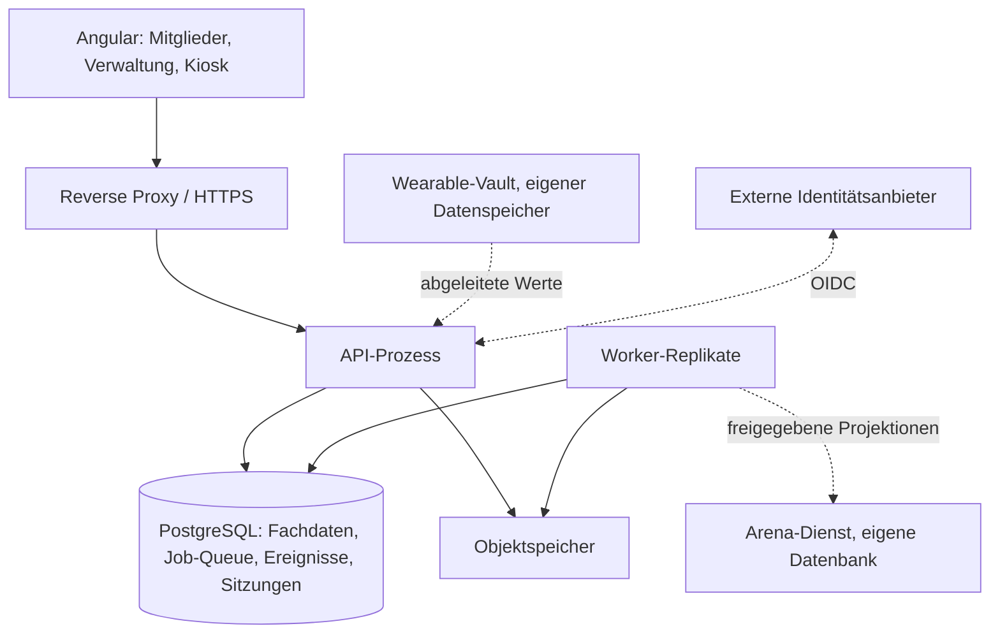

# CompanyHero – Backend-Architektur

**Stand:** 20.09.2026  
**Status:** Beschlossen gemäß A-001, A-005, A-006, A-007, A-011, A-012 und A-013 im [Entscheidungsregister](architektur-entscheidungen.md). Noch keine Implementierung und keine technisch ausgeführte Abnahme.  
**Geltungsbereich:** Backend, Datenhaltung, Jobverarbeitung, Sitzungen, Schnittstellen und serverseitiger Betrieb. Das Frontend steht in der [Frontend-Architektur](architektur-frontend.md), der Modulschnitt in [Domänen und Schnittmengen](domaenen-und-schnittmengen.md).

## 1. Beschlossene Basis

| Gegenstand | Beschluss |
|---|---|
| Betriebsplattform | Linux; alle eigenen Laufzeitkomponenten einschließlich Datenbank und Betriebswerkzeugen in Docker (A-001) |
| Sprache und Framework | C# mit ASP.NET Core auf .NET 10 LTS (A-001) |
| Datenbank | PostgreSQL, Zielversion 18, EF Core mit Npgsql (A-011) |
| Mandantenmodell | gemeinsame Tabellen mit `tenant_id`, zusammengesetzte Fremdschlüssel, Row Level Security (A-011) |
| Anwendungsarchitektur | modularer Monolith; API und Worker als zwei Prozesse aus einem Image; Arena und Wearable-Vault als isolierte Dienste (A-012) |
| Jobverarbeitung | logische Queue in PostgreSQL, transaktional eingereiht, Worker-Replikate mit `SKIP LOCKED` (A-006) |
| Sitzung und Anmeldung | serverseitige Cookie-Sitzung unter gemeinsamer Origin; externe Identitätsanbieter, Magic-Link und Passkey als Basisfunktion (A-007) |
| Kiosk | Gerätesitzung plus Personensitzung, Online-Erfassung mit serverseitig reservierter Vorgangskennung (A-005) |
| Theme-Ableitung | im Backend, versionierter Tokensatz je Tenant (A-013) |
| Entwicklungsweise | agentisch mit Test Driven Development; Compilerprüfung, Architekturtests und Integrationstests gegen echtes PostgreSQL |

.NET 10 ist eine LTS-Version mit Support bis November 2028 und läuft in Linux-Containern ohne Windows, IIS oder SQL Server. Quellen: [Microsoft: Docker und .NET](https://learn.microsoft.com/en-us/dotnet/core/docker/introduction), [Support-Zeiträume](https://dotnet.microsoft.com/en-us/platform/support/policy/dotnet-core).

## 2. Anforderungen, die diese Architektur erfüllt

- Viele Firmen nutzen dieselbe Plattform mit getrennten Mitgliedern, Aktivitäten, Konfigurationen und freigeschalteten Modulen.
- Innerhalb einer Firma gelten zusätzliche Zugriffsregeln: Mandantentrennung allein schützt persönliche Aktivitäten nicht vor einem Administrator derselben Firma. Niemand innerhalb eines Tenants sieht individuelle Aktivitätswerte einer anderen Person, außer diese hat sie über ihre Sichtbarkeitseinstellung freigegeben.
- Aggregierte Auswertungen erscheinen erst ab einer Mindestzahl beitragender Personen; darunter wird nichts angezeigt.
- Challenges, Fortschritt, Sichtbarkeit, Entitlements und Abrechnung enthalten zahlreiche verbundene Fachregeln, die häufig in gemeinsamen Transaktionen geschrieben werden.
- Wiederholte Offline-Übertragungen, Kiosk-Wiederholungen und Webhooks dürfen Beiträge, Punkte und Abrechnungsereignisse nicht doppelt erzeugen.
- Hintergrundarbeit umfasst Erinnerungen, Aggregationen, Exporte, Dokumenterzeugung, Löschläufe und Integrationen.
- Firmenübergreifende Arena und Wearable-Verarbeitung benötigen eigene Datenzugriffsgrenzen: In die Arena gelangen nur freigegebene Projektionen, aus dem Vault nur abgeleitete Werte.
- Module werden pro Firma freigeschaltet; eine Freischaltung erzeugt keine eigene Softwareinstallation.
- Authentifizierung über externe Identitätsanbieter, Magic-Link und Passkey ist Voraussetzung für das Onboarding jeder Kundenorganisation.

**Arbeitsannahmen:** kleines Entwicklungsteam, Aufbau ohne konkreten Kunden, eine gemeinsame Produktversion für alle Firmen, geplantes Kundenwachstum. Last-, Verfügbarkeits- und Wiederherstellungsziele stehen in A-027; die Architektur skaliert über Worker- und API-Replikate, ohne ihre Grenzen zu verschieben.

## 3. Anwendungsarchitektur: modularer Monolith

### 3.1 Prozesse

API und Worker entstehen aus derselben Codebasis und demselben Container-Image; sie unterscheiden sich nur im Einstiegspunkt. Beide laden dieselben Fachmodule. Die API bedient HTTP-Anfragen und reiht Folgearbeit in die Queue ein; Worker verarbeiten Jobs, Fachereignisse, zeitgesteuerte Aufgaben und Integrationen. Beide Prozesse sind unabhängig replizierbar.

### 3.2 Module

Der fachliche Schnitt steht in der [Domänenkarte](domaenen-und-schnittmengen.md). Für jedes Modul gelten dieselben Regeln:

- Ein Modul ist ein eigenes Projekt mit ausdrücklich erlaubten Referenzen. Architekturtests prüfen die Abhängigkeitsrichtung bei jedem Build.
- Ein Modul besitzt seine Tabellen in einem eigenen Datenbankschema und einen eigenen EF-Core-DbContext. Kein Modul liest oder schreibt Tabellen eines anderen Moduls.
- Zugriff zwischen Modulen erfolgt über öffentliche Anwendungsfunktionen mit ausdrücklichen Verträgen oder über Fachereignisse. Synchron, wenn ein Ergebnis in derselben Transaktion benötigt wird; asynchron über Ereignis und Job, wenn nicht.
- Innerhalb eines Moduls sind HTTP-Schnittstelle, Anwendungsablauf, Fachregeln und Infrastruktur getrennt. Fachregeln haben keine Abhängigkeit auf EF Core oder ASP.NET Core.
- Querschnitte wie Tenant-Kontext, Autorisierung, Sichtbarkeitsregeln, Prüfprotokoll und Metering-Emission werden von genau einem Eigentümer bereitgestellt und von allen Modulen über dessen Schnittstelle verwendet.
- Kein Netzwerkdienst je Modul, kein allgemeines Repository-Framework, kein flächendeckendes Event Sourcing.

Gemeinsame Transaktionen über Modulgrenzen hinweg sind erlaubt, weil alle Module dieselbe Datenbank verwenden. Genau das ist der Grund für den Monolithen. Die Modulgrenzen halten den Pfad offen, ein Modul später mit seinem Schema herauszulösen, wenn Datenisolation oder gemessene Last es rechtfertigen.

### 3.3 Isolierte Dienste

Arena und Wearable-Vault sind keine Module des Monolithen, sondern eigene Dienste mit eigenem Datenspeicher, eigenen Zugangsdaten und eigenen Netzwerkregeln. Die Arena erhält ausschließlich freigegebene Projektionen über eine ausdrückliche Schnittstelle; eine Sicht über Mitgliederdaten aller Tenants wäre keine ausreichende Grenze. Der Vault benötigt kontrollierte ausgehende Verbindungen zu Hersteller-APIs; welche abgeleiteten Werte ihn verlassen dürfen, wird im Wearable-Thema festgelegt. Beide Dienste verwenden denselben Stack und dieselben Betriebsregeln wie der Monolith.

## 4. Datenbank

PostgreSQL trägt Fachdaten, Job-Queue, Fachereignisse und Sitzungsspeicher. Überwiegend relationale Daten und gemeinsame Transaktionen passen zu diesem Modell. Konfigurierbare Challenge-Regeln dürfen versioniertes JSONB verwenden; Mitgliedschaften, Buchungen, Beiträge und Rechnungspositionen sind strukturierte Tabellen.

Geldbeträge und Tarife erhalten eine ausdrücklich definierte Dezimalpräzision und Rundungsregel; binäre Gleitkommaarithmetik wird dafür nicht verwendet. Identifikatoren sind zeitlich sortierbare eindeutige Kennungen, keine laufenden Nummern.

Die Major-Version wird beim Projektstart zusammen mit Treiber und benötigten Erweiterungen festgeschrieben; produktiv läuft eine unterstützte Version mit aktuellem Patchstand. Quelle: [PostgreSQL Versioning Policy](https://www.postgresql.org/support/versioning/).

## 5. Multi-Tenancy

### 5.1 Schutzschichten

1. **Vertrauenswürdiger Tenant-Kontext:** Der Tenant wird aus geprüfter Sitzung und Mitgliedschaft ermittelt. Subdomain, URL oder Header dürfen den gewünschten Tenant benennen, ersetzen aber keine Berechtigungsprüfung. Beim noch nicht angemeldeten Beitritt bestimmt ein serverseitig geprüfter Einladungscode den Tenant.
2. **Kontext pro Request und Job:** kein global veränderlicher Tenant-Zustand. Worker setzen für jeden Job einen neuen Kontext. Partnerrechte ergeben sich aus Berechtigungen, nicht aus der Organisationshierarchie.
3. **Datenintegrität:** tenantbezogene Tabellen mit `tenant_id NOT NULL`, zusammengesetzte Fremdschlüssel wie `(tenant_id, challenge_id)`, Eindeutigkeit an den fachlich richtigen Tenant-Grenzen.
4. **Row Level Security:** Policies beschränken Lesen und Schreiben auf den aktiven Tenant. Die Laufzeitrolle ist weder Tabellenbesitzer noch Superuser und hat kein `BYPASSRLS`. Migrationen laufen mit eigenem Zugang. Quelle: [PostgreSQL: Row Security Policies](https://www.postgresql.org/docs/current/ddl-rowsecurity.html).
5. **Berechtigungen innerhalb des Tenants:** Eigentum, Rolle, Sichtbarkeit und Freigaben gelten zusätzlich. RLS auf `tenant_id` verhindert nicht, dass ein Firmenadministrator persönliche Daten derselben Firma liest; das verhindert die Sichtbarkeitsregel des Datenschutzmoduls.
6. **Isolation außerhalb der Datenbank:** Objektspeicherpfade, Cache-Schlüssel, Exporte, Echtzeitkanäle und Jobdaten berücksichtigen Tenant und gegebenenfalls Person und Sichtbarkeit.

RLS ist eine zusätzliche Grenze gegen fehlerhafte Datenzugriffe, keine Absicherung gegen einen kompromittierten Backend-Prozess: Wer den Kontext setzen darf, kann einen falschen setzen. Parameterisierte Abfragen, Berechtigungsprüfung und begrenzte Datenbankrechte bleiben notwendig.

### 5.2 Transaktionen und Connection-Pooling

Für jede tenantbezogene Datenbankoperation wird der geprüfte Kontext innerhalb derselben kurzen Transaktion auf derselben Verbindung mit transaktionslokalem `set_config(..., true)` gesetzt. Der Kontext endet mit der Transaktion und kann nicht für den nächsten Pool-Nutzer fortbestehen. Externe HTTP-Aufrufe finden nicht in offenen Transaktionen statt. Quelle: [PostgreSQL: Konfigurationsfunktionen](https://www.postgresql.org/docs/current/functions-admin.html).

Fehlender oder ungültiger Kontext führt zu Ablehnung, nie zu unbeschränktem Zugriff. Bei Wiederholungen nach Transaktionsfehlern werden Transaktion und Kontext gemeinsam neu aufgebaut. Das gilt für Leseabfragen, Exporte und Jobs gleichermaßen.

EF-Core-DbContexte sind kurzlebig und werden nicht gepoolt; das Verbindungspooling von Npgsql bleibt aktiv. Quelle: [EF Core: Pooling und Tenant-Zustand](https://learn.microsoft.com/en-us/ef/core/performance/advanced-performance-topics).

### 5.3 Plattformdaten und Operator-Funktionen

Globale Vorlagen, Organisationsverwaltung, Anbieterkonfigurationen und die Job-Queue liegen im Plattformbereich und werden getrennt von tenantbezogenen Mitgliederdaten modelliert. Operator-Funktionen erhalten begrenzte Anwendungsfälle mit eigenen Rechten und Protokollierung; ein normaler Request bekommt keinen Schalter zum Abschalten der Isolation.

## 6. Jobverarbeitung: logische Queue in PostgreSQL

### 6.1 Einreihung

Ein Job wird in derselben Transaktion geschrieben wie die fachliche Änderung, die ihn auslöst. Beispiel: Ein gültiger Challenge-Beitrag wird mit seiner Idempotenzkennung, dem Fachereignis „Beitrag erfasst“ und den Folgejobs für Fortschritt, Feed, Benachrichtigung und Metering in einer Transaktion gespeichert. Erst nach dem Commit sind die Jobs sichtbar. Damit gibt es keinen bestätigten Fachvorgang ohne Folgearbeit und keinen Job ohne Fachvorgang.

### 6.2 Tabellen

| Tabelle | Bereich | Inhalt |
|---|---|---|
| `job` | Plattform, ohne Tenant-RLS | Job-ID, Tenant-ID, Jobtyp, fachliche Referenz, Ausführungszeitpunkt, Lease-Ablauf, Versuche, Status, Idempotenzschlüssel |
| Fachereignisse je Modul | tenantbezogen, RLS | Ereignistyp, Nutzdaten, Zeitpunkt, Verursacher |
| `job_schedule` | Plattform | zeitgesteuerte Aufgaben mit letzter und nächster Ausführung |

Die Queue-Tabelle enthält keine fachlichen Nutzdaten. Ein Worker prüft die Zuordnung von Tenant und Job, setzt den Tenant-Kontext und lädt die Nutzdaten erst darin.

### 6.3 Verarbeitung

- Beanspruchung mit `UPDATE … WHERE id IN (SELECT … FOR UPDATE SKIP LOCKED)` und gesetztem Lease; abgelaufene Leases werden erneut beansprucht.
- Jeder Job läuft in eigenem Tenant-Kontext und eigener Transaktion. Bestätigung erst nach dauerhafter Verarbeitung.
- Wiederholungen mit wachsender Wartezeit bis zu einem Maximum; danach Dead-Letter-Status. Replay ist eine bewusste Operator-Aktion mit Protokoll.
- Mehrfache Zustellung wird erwartet. Fortschritt, Benachrichtigungen und Metering deduplizieren über fachliche Eindeutigkeitsschlüssel; Geld- und Verbrauchsdaten erhalten eigene Schlüssel.
- Fairness: begrenzte gleichzeitige Jobs je Tenant und eine Beanspruchungsreihenfolge, die Tenants abwechselnd bedient. Ein großer Kunde belegt nicht alle Worker.
- Zeitgesteuerte Aufgaben werden über eine Datenbanksperre gegen parallele Doppelausführung geschützt.
- Warteschlangenlänge, Alter des ältesten Jobs, Fehlerquote und Dead-Letter-Bestand sind Metriken.

### 6.4 Fachereignisse zwischen Modulen

Ein Modul veröffentlicht Fachereignisse in seiner eigenen Ereignistabelle. Abonnenten anderer Module werden als Jobs zugestellt; sie lesen die Ereignisse über die öffentliche Schnittstelle des veröffentlichenden Moduls, nicht über dessen Tabellen. Ereignisse sind versioniert; Abonnenten sind idempotent.

### 6.5 Erweiterungspfad

Ein externer Broker wird erst eingeführt, wenn gemessener Durchsatz oder eine erforderliche Integration es verlangt. Die Queue-Schnittstelle bleibt dann unverändert; nur der Transport wechselt. Bis dahin gibt es keinen Redis, keinen Broker und keinen eigenen Dispatcher-Prozess.

### 6.6 Werkzeug

Bevorzugt wird eine gepflegte PostgreSQL-basierte .NET-Jobbibliothek, sofern sie transaktionale Einreihung, Leases, Retries, Dead-Letter und Tenant-Fairness abbildet. Andernfalls entsteht eine kleine eigene Umsetzung auf `SKIP LOCKED`. Die Wahl fällt im Durchstich; eine umfangreiche eigene Jobplattform entsteht nicht.

## 7. Sitzung und Anmeldung

Die CompanyHero-Sitzung ist serverseitig, in PostgreSQL gespeichert und wird über ein Secure-/HttpOnly-Cookie unter der gemeinsamen Origin geführt. ASP.NET Core Data Protection verwendet persistente, geschützte Schlüssel, damit mehrere API-Instanzen dieselben Cookies lesen. Sitzungswiderruf wirkt serverseitig.

Anmeldewege sind Basisfunktion und gleichrangig:

| Weg | Ablauf | Persistierte Verknüpfung |
|---|---|---|
| Externer Identitätsanbieter | OIDC Authorization Code Flow mit PKCE, Callback und Codeaustausch im Backend | Issuer und Subject beziehungsweise geprüfter stabiler Anbieterschlüssel |
| Magic-Link | einmaliger, kurzlebiger Link per E-Mail | ausdrücklich hinterlegte E-Mail |
| Passkey | WebAuthn, mit Wiederherstellungscode für den Geräteverlust | Credential-ID und öffentlicher Schlüssel |

E-Mail- und Namensclaims externer Anbieter werden nur für den Anmeldevorgang verarbeitet und nicht gespeichert. Der Anzeigename wird nie aus Claims befüllt. Mehrere Anmeldewege verweisen auf dieselbe interne Person. Externe Anmeldung begründet weder Mitgliedschaft noch Rollen; beides prüft das Organisationsmodul.

Der Kiosk verwendet zwei geschachtelte Sitzungen: eine Gerätesitzung über ein widerrufbares Gerätegeheimnis ohne Personenrechte und eine kurzlebige Personensitzung nach Anmeldung mit Kiosk-Kennung und PIN. Die Personensitzung endet automatisch nach Inaktivität und nie nach der Gerätesitzung. Laufzeiten, Codes und Abläufe stehen in [Zugang und Identität](zugang-und-identitaet.md).

Zustandsändernde Aufrufe erhalten CSRF-Schutz; es gibt kein Cross-Origin-Credential-CORS. Es wird keine eigene Kryptografie gebaut.

## 8. Theme-Ableitung und serverseitige Dokumente

Das Backend leitet aus der Tenant-Saatfarbe die vollständige Palette für hell und dunkel ab, prüft alle Rollenpaare gegen WCAG 2.2 AA und ersetzt durchgefallene Rollen durch die nächstliegende zulässige Ableitung derselben Farbe. Das Ergebnis ist ein versionierter Tokensatz je Tenant. Die Ableitung ist deterministisch und mit Referenzwerten getestet.

Die Mitglieder-App lädt den Tokensatz, die Admin-Vorschau ruft die Ableitung ohne Persistierung über einen Endpunkt ab, und serverseitig erzeugte Dokumente wie das Aushang-PDF verwenden denselben gespeicherten Tokensatz. Es gibt keine zweite Ableitung im Frontend. Ungültige Eingaben führen zum geprüften Standard-Theme.

## 9. Entwicklungsablauf und Testsetup

1. Fachliche Akzeptanzfälle einschließlich verbotener Zugriffe werden vor der Implementierung aus den Anforderungen formuliert.
2. Ein Test wird geschrieben und sein Fehlschlag aus dem erwarteten fachlichen Grund nachgewiesen. Ein fehlendes Paket oder ein defekter Container ist kein roter Test.
3. Die kleinste passende Implementierung ergänzt, bis der Test besteht.
4. Refaktorieren mit laufenden Tests, danach Integrations- und Architekturprüfungen.
5. Akzeptanztests und Sicherheitsregeln werden nicht abgeschwächt, damit eine Implementierung besteht. Änderungen an erwarteter Fachlogik brauchen einen Bezug zur abgestimmten Anforderung.

Testsetup: xUnit als einheitliches Framework; schnelle Fachtests ohne Infrastruktur; WebApplicationFactory für API-Abläufe; echtes PostgreSQL in Testcontainern mit den tatsächlichen Laufzeitrechten für Persistenz, RLS und Isolation; Architekturtests für Modulabhängigkeiten; Nullable-Prüfung, festgelegte Analyseregeln und Warnungen als Fehler. Gezielte Mutationstests prüfen später die Aussagekraft kritischer Berechtigungs- und Abrechnungstests. Quellen: [ASP.NET Core Integrationstests](https://learn.microsoft.com/en-us/aspnet/core/test/integration-tests?view=aspnetcore-10.0), [Testcontainers PostgreSQL](https://dotnet.testcontainers.org/modules/postgres/).

Build und Tests haben dokumentierte CLI-Einstiegspunkte und ein festgelegtes SDK. Containerisierte Prüfläufe verwenden einen isolierten Docker-Testhost; der Docker-Socket des Produktivhosts gehört nicht in die Testumgebung. Datenbanktests teilen Infrastruktur innerhalb eines Laufs mit getrennten Testdaten; zufällige Ports, feste Testuhren und eindeutige Datenbereiche machen Läufe reproduzierbar.

## 10. Technische Betriebsbasis

| Baustein | Festlegung |
|---|---|
| Betriebsumgebung | Linux und Docker; ein Produktivhost mit Docker Compose, Übergang zu k3s nur bei den Triggern aus A-028 |
| HTTPS-Eingang | Caddy als einzige öffentlich erreichbare Komponente (A-029) |
| API und Worker | zwei Prozesse aus einem Image, unabhängig replizierbar |
| Datenbank | PostgreSQL 18 mit persistentem Volume; Backup über pgBackRest mit WAL-Archivierung (A-031) |
| Dateien und Medien | Garage als S3-kompatibler Objektspeicher im Container, tenantpräfigierte Pfade, kurzlebige signierte URLs (A-029) |
| Geheimnisse | OpenBao: Transit für Tenant-Datenschlüssel, KV für Anwendungsgeheimnisse (A-029) |
| API-Vertrag | HTTP/JSON und OpenAPI mit generiertem TypeScript-Client (A-009) |
| Beobachtung | OpenTelemetry Collector, Prometheus, Loki, Tempo, Grafana; Logs ohne Personenbezug (A-029) |
| Migrationen | separater kurzlebiger Deployment-Container mit eigenen Rechten, vor dem Anwendungsstart (A-030) |
| Lieferkette | GitHub, GitHub Actions, GitHub Container Registry, Deployment per SSH (A-030) |

Die vollständige Betriebsplanung mit Zielen, Netz, Umgebungen, Backups und Prozessen steht in [Betrieb](betrieb.md). Container ersetzen keine Sicherung.

## 11. Nachweise im technischen Durchstich

Ein kleiner Durchstich belegt die kritischen Grenzen, bevor Produktcode in der Breite entsteht:

1. Zwei Tenants, mehrere Rollen und persönliche Daten anlegen; tenantfremde Lese- und Schreibzugriffe einschließlich Raw SQL und Beziehungen scheitern.
2. Fehlender Tenant-Kontext, Pool-Wiederverwendung, parallele Requests, Rollback und Retries verhalten sich wie festgelegt.
3. Ein Tenant-Admin erhält trotz gleicher `tenant_id` keine privaten Aktivitäten.
4. Ein Offline-Beitrag mit Client-Idempotenzschlüssel und ein Kiosk-Beitrag mit Vorgangskennung werden mehrfach übertragen: genau ein fachlicher Beitrag und eine korrekte Verbrauchsbuchung.
5. Worker während eines Jobs beenden und neu starten: keine verlorene bestätigte Aufgabe, keine doppelte Wirkung; Fairness über zwei Tenants mit ungleicher Last.
6. Login mit Microsoft, Google und generischem OIDC; im Datenbestand liegen nur Issuer und Subject.
7. Kiosk: Widerruf des Gerätegeheimnisses beendet die Personensitzung; Personenwechsel übernimmt keine Daten.
8. Zwei Firmenmarken liefern identische Farbwerte in App, Vorschau und PDF.
9. Ein Modul wird probeweise herausgelöst gedacht: Architekturtests und Schemata belegen, dass kein fremder Zugriff existiert.
10. Containerisierte Datenbank sichern und in getrennter Umgebung wiederherstellen.

Diese Tests verwenden echtes PostgreSQL mit den tatsächlichen Laufzeitrechten. Eine In-Memory-Datenbank kann die RLS-Eigenschaften nicht belegen.
